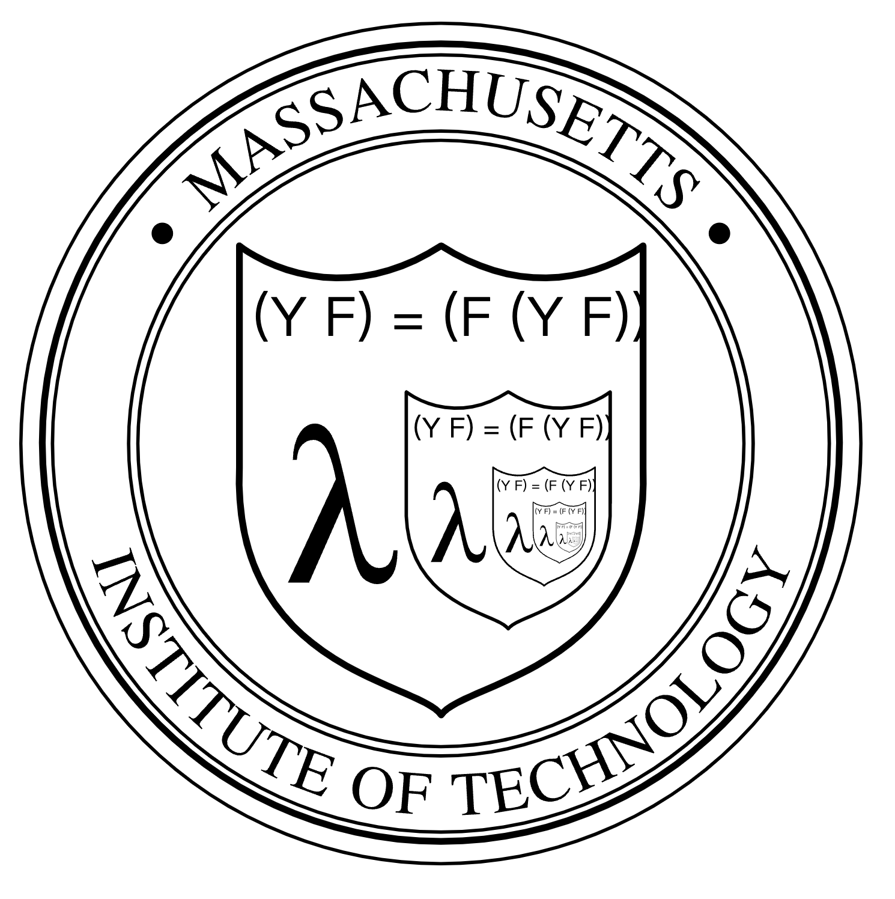

# Fix point combinator in Rust

It has been many years since Haskell discovered the *Y* combinator.
It's such a milestone that it makes *lambda calculus* turing complete.
Let's try to implement it in Rust and have fun!


## Fix point of a function

What do we mean by "fix point"?
Well, in fact, it's quite simple. A *fix point* of a function $f$ is a parameter $x$ with the following equation:
$$
f(x) = x
$$

This does not seem to be fun...
But if we try to flip the equation, it's quite interesting:
$$
x = f(x) = f(f(x)) = f(f(f(x))) = f^n(x)
$$
If we can find a fix point, then we have recursion and loops for free!
Now suppose we want to build a magic wand Y, for any function $f$, whenever we apply the wand to $f$,
we automaically get the fix point of $f$, that is:
$$
Y(f) = f(Y(f))
$$
$Y(f)$ becomes the fix point of function $f$!
But does this magic wand exist? Haskell said *YES*!

<center>
<br/><br/>
figure 1
</center>

## *Self* as parameter
Before we actually find the magic wand, let's first try to consider another question:
> [!NOTE] QUESTION
> Can we write recursions using pure lambda expressions without name binding?

For example, if one want to write a recursive factorial function:
```rust
fn fact(n: usize) -> usize {
    if n == 0 {
        1
    } else {
        n * fact(n - 1)
    }
}
```

If we cannot use name binding, then we cannot use name `fact` inside function definition of `fact`:
```rust
fn fact(n: usize) -> usize {
    if n == 0 {
        1
    } else {
        n * todo!("how???")
    }
}
```
Well, since we cannot directly bind the name, let's try to pass a function as it self:
```rust
fn fact(f: &dyn Fn(usize) -> usize, n: usize) -> usize {
    if n == 0 {
        1
    } else {
        n * f(n - 1)
    }
}
```
But the problem still remains. How do we pass the parameter `f`?


### Application in real world
At first glance, you may assume recursion without name binding is useless.
`todo!()`

## Ω combinator

$$
\omega(x) = x(x)
$$
`todo!()`

## Recursive type
> Typing is hard.

## Strict or lazy
`todo!()`

## Y combinator
`todo!()`

## Lambek's lemma and F-Algebras
`todo!()`


