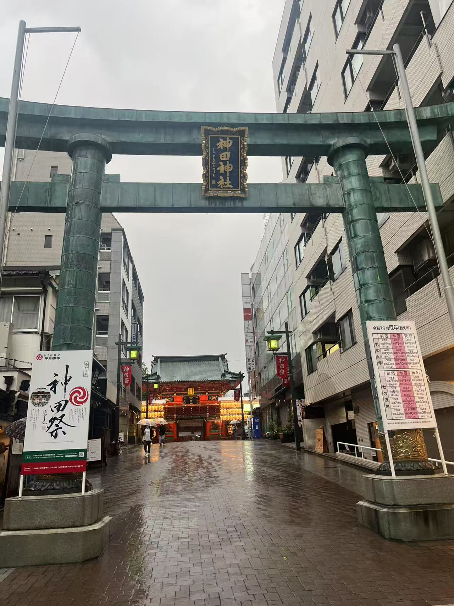
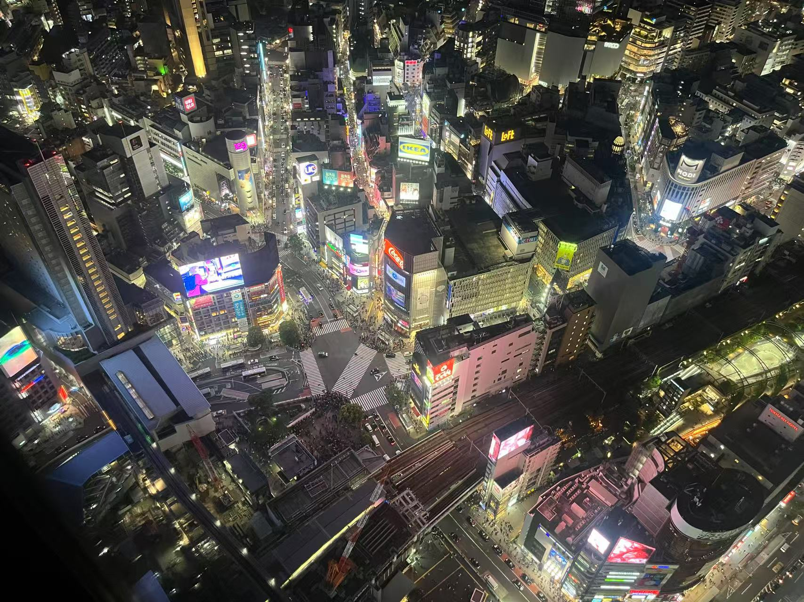

# 五一日本之旅

这个五一假期和几个朋友一起去日本转了转，有一些有趣的风景和见闻，我们的行程还是有些吃紧的，用一星期的时间去了东京、大阪和京都。
可惜当时旅行期间太疲劳没有当时立刻记录感受，事后再写下的本篇显得有些线性且流水线。

## 东京
第一次跨国旅行还是有些紧张的，十分感谢我的一位朋友和我一起帮助了我不少，终于成功乘坐全日空成功抵达东京。
一下飞机最大的感受就是学好英文真是重要，英语突然成了我理解各种说明的救命稻草哈哈哈。

### 秋葉原
到酒店放好行李，我们首先去了最近的秋叶原，据说这里是二次元的重灾区哈哈哈。作为命运石之门的爱好者，我首先记录了一些印象中动画里出现过的场景：

接下来是著名的「世界的ラジオ会館」，是石头门最主要的场景之一：

当然也少不了二次元的气息：

在ラジオ会館里逛了逛突然发现现在的新番和动画我都不太懂了，可能我年纪大了2333，唯一一个感兴趣的手办太贵了只能放弃。
出了会馆又去了附近的animate和一些小店，突然天空开始下大雨，我们在附近一个神社避了会儿雨：

神社里有一些留下的祈愿还挺有趣：

不觉已经到了傍晚，我们和另外一位同学汇合后回酒店休息，附上经典饮料Dr.pepper，我感觉味道居然还可以。

### 池袋
下过雨之后的东京天气很好，出门就看到了阳光：

我们首先在「池袋」汇合，可惜忘记拍一下里面的场景了，里面有的地方让我想起了无头骑士异闻录：

有趣的是看来日本也在对托福考试苦恼。

有趣的一角：

「员工爱睡懒觉，来早没用」

### 川越
川越我不算很熟悉，整体主要是和朋友一起观光：

### 涩谷
涩谷应该是这次旅行最有现代化都市的一集。

虽然非常现代化，天气却意外的不错。

经典十字路口，确实人非常非常多，能看到很多不同国家的人，还有老外在开卡丁车玩。

我们登上了shibuya sky，俯瞰这里的一景：

附上毛利侦探事务所：

### 台场
我的台场之旅一大半是为了「数码宝贝」的圣地巡礼哈哈哈。

首先自然是在台场海滨公园站下，还原了动画中的场景。

未完待续

### 镰仓

## 大阪

## 京都
